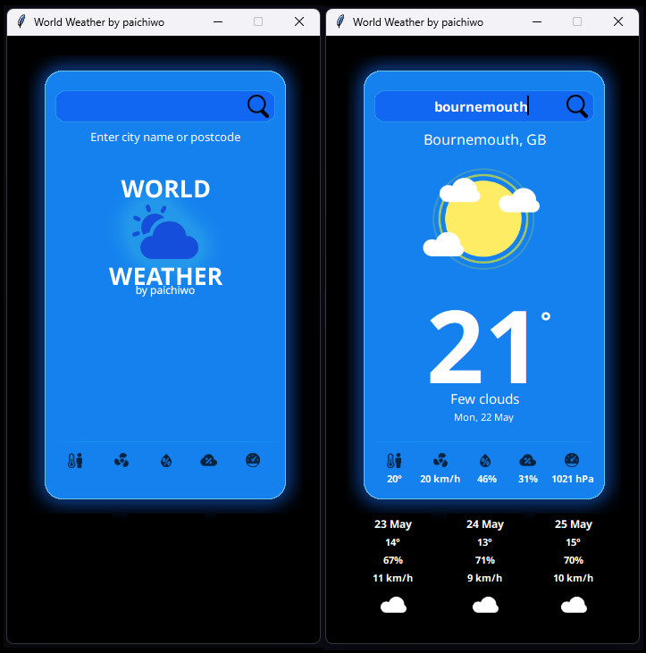

# **World Weather with tkinter GUI**

This Python application utilizes the tkinter library for the graphical user interface (GUI) and the [weatherapi.com](https://weatherapi.com) API to provide current weather information for any specified location.

The app consists of three main sections:

1. **Search Bar**: Allows users to search for locations worldwide using city names, country names, or postcodes.   
   - when empty, the application will use the current user location based on IP address.
2. **Current Weather**: Displays the weather information for the present day.
3. **3-Day Forecast**: Provides a forecast for the next three days.

## **Prerequisites**

To run this app, you need to have Python 3.x and PySimpleGUI installed. You also need to sign up for a free API key from [weatherapi.com](https://weatherapi.com/) and paste it in the **api\_key** variable in the code.

You can install the required modules via pip:

- `pip install requests`
- `pip install black`
- `pip install isort`
- `pip install pytest`
- `pip install ruff`

Alternatively, run this command for automatic module installation:

`pip install -r requirements.txt`

#### For the best experience, please install `NotoSans fonts` from the `fonts` folder.

## **How to Run**

To run the app, open a terminal in the folder containing the code file, and type:

`python world-weather.py`

This should open the app window.    

Enter a location manually (e.g., "London" or "BH6 5PL) and click the "Search" button (or press Enter) to update the weather information.   
NOTE: User location will be used (based on IP address) if location field left empty.

The icons in the bottom row represent the following:
   - "Feels like" temperature
   - Wind speed
   - Humidity
   - Cloud coverage
   - Pressure

## **Contributing**

Contributions are always welcome and appreciated! If you find any issues or have suggestions for improvements, please feel free to open an issue or pull request on the GitHub repository.

To contribute, please follow these steps:

1.  Fork the repository to your own GitHub account.
2.  Clone the repository to your local machine.
3.  Create a new branch for your changes.
4.  Make your changes and commit them with clear commit messages.
5.  Push your changes to your forked repository.
6.  Open a pull request to the main repository.

Please ensure that your code is well-documented, tested, and follows the existing code style and guidelines. By contributing, you agree to release your code under the same MIT license as the original code.

## **License**

This app is released under the [MIT License](https://opensource.org/licenses/MIT). Feel free to use, modify, and distribute it as you like.

## **Examples**

